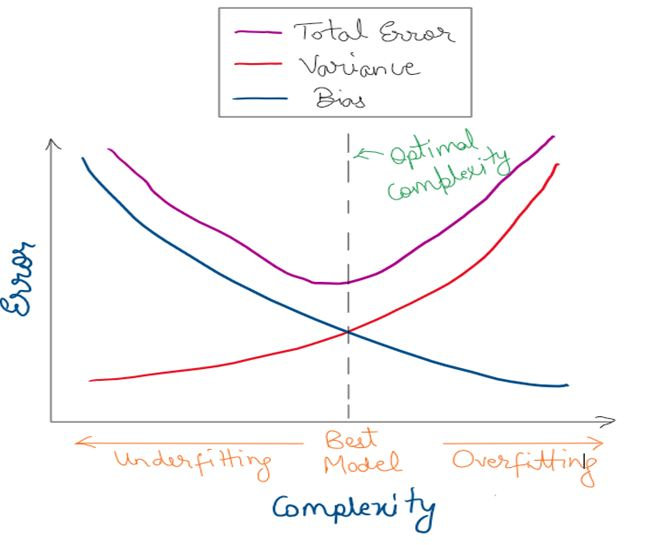

## Part 1: Short Answer Questions

1. Imagine you have been hired as a data consultant. Your client has given you the task of building a classifier for a new dataset they have constructed. In each of the following 5 scenarios, would you recommend a flexible statistical learning method or an inflexible approach? Why? (2-3 sentences per scenario)
    a) There is a large sample size of $N=5 \text{ billion}$, a large number of predictors $p=100,000$, and the client is limited in their computing resources. *Flexible models are computationally expensive. An inflexible model will allow us to work with a large sample size without using too many computing resources.*
    b) Large sample size of $N=5 \text{ billion}$, and small number of predictors $p=6$. *A flexible model will allow us to take full advantage of our large sample size.*
    c) Large number of predictors, $p=125,000$, sample size $N=2000$ is relatively small. *A flexible model will cause overfitting due to our small sample size.*
    d) Based on exploratory analysis of the data, it appears that the predictors and the response have a non-linear relationship. *A flexible model will be necessary to find the nonlinear effect.*
    e) The error term has very large variance. *A flexible model will cause us to fit too much of the noise in the problem.*

2. How is a **parametric** approach different from a **non-parametric** approach to statistical learning? How does each approach go about estimating $f$ (functional form)? Name three advantages and three disadvantages of each class of models. (2-3 sentences per approach)

**Parametric models:** 

- The number of parameters remains fixed, regardless of N.
- Makes assumptions about the functional form (i.e. function is linear); estimates parameters that define this functional form, e.g $\beta$
- Pros: More interpretable/usually better for inference, faster, require less data
- Cons: Often biased (unlikely to closely match the underlying function), can underfit data, do not work well if underlying functional form is complex

**Non-parametric models**

- The number of parameters increases as N increases.
- Fewer assumptions about the functional form
- Objective: Get as close as possible to the data
- Examples: decision trees, KNN, splines
- Pros: Fewer assumptions about the underlying functional form, can be more accurate when underlying functional form is complex, work well with large datasets
- Cons: slow, prone to **overfitting**, **curse of dimensionality** (error increases with number of features), require a lot more data

3. _ISL 2.4 Exercise 2_

Explain whether each scenario is a classification or regression problem and indicate whether we are most interested in inference or prediction. Finally provide sample size ($n$) and predictors ($p$).

a. Regression, inference, $n=500$, $p=3$
b. Classification, prediction, $n=20$, $p=13$
c. Regression, prediction, $n=52$, $p=3$

4. _ISL 2.4 Exercise 3_

a)



b)


- **Bias:** decreases as flexibility increases; closer fit of training data
- **Variance:** increases as flexibility increases; the approximated function changes dramatically with new data if overfitting to training data
- **Training Error:** decreases as flexibility increases; closer fit to training data, so error is low and an optimistic estimate of generalization error.
- **Test Error:** decreases at first as flexibility increases and then increases again once the model begins to overfit.
- **Bayes Error:** (The lowest possible prediction error for any classifier) remains constant; it is the lower limit for the test error

5. What are the two kinds of "big data" Rocio Titiunik wrote about in her paper on big data? What are some benefits and drawbacks of each kind of big data analysis for social scientific inquiry? Can either kind of big data solve the fundamental problem of causal inference? (5-10 sentences)

**Big N**

Big N data have many observations (rows). Because of the law of large numbers, as N increases, we will get closer to the estimate as long as the estimator is unbiased. However, large N does not address inconsistency of estimators. If an estimator is biased, it will still be biased in large N. Large N data can however aid in discovery and exploration as it can be used with non-parametric models that can estimate more complicated functions.


**Big P**

Big p data have many predictors (columns). Many claim that big p data can aid in causal inference by controlling for observables that may otherwise confound causal inference. Even with a large number of predictors, we still however must assume that we have controlled for all variables necessary for exogeneity ($x$ is not dependent on $y$). Unfortunately, we will never know definitively if that is true.

## Part 2: Coding Questions

6. In the next problem set, we will use `for` loops and `if`/`else` statements to implement $k$-fold cross-validation. To prepare you for this, we'll practice them using the [fibbonacci sequence](https://en.wikipedia.org/wiki/Fibonacci_number). The fibbonacci sequence is a sequence where each number is the sum of the two preceding ones: $(0,) 1, 1, 2, 3, 5, \dots$. Using `for` loops and `if`/`else` statements, write code that will output the sum of the first 50 terms of the fibbonacci sequence. Include zero as the first term.

```{r}
# Numeric vector of length 50
fibvals <- numeric(50)

# for number in range 1 to 50
for (i in 1:50) {
  # if number is 1 ...
  if (i == 1) {
    # Then value at index number is set to 0
    fibvals[i] <- 0
    # else if (multiple conditions) number is 2 ...
  } else if (i == 2) {
    # Then value at index number is set to 1
    fibvals[i] <- 1
    # else value at index number is the sum of the two preceding numbers.
  } else {
    fibvals[i] <- fibvals[i-1]+fibvals[i-2]
  }
}
sum(fibvals)
```

7. _ISL 2.4 Exercise 10_ (Note: Please break text out of code blocks when explaining or reporting your answers.)

```{r}
# Code for 10 a) goes here
library(MASS)

nrow(Boston)
ncol(Boston)

?Boston
```

Rows represent towns. Columns represent the following:

- `crim`: per capita crime rate by town.
- `zn`: proportion of residential land zoned for lots over 25,000 sq.ft.
- `indus`: proportion of non-retail business acres per town.
- `chas`: Charles River dummy variable (= 1 if tract bounds river; 0 otherwise).
- `nox`: nitrogen oxides concentration (parts per 10 million).
- `rm`: average number of rooms per dwelling.
- `age`: proportion of owner-occupied units built prior to 1940.
- `dis`: weighted mean of distances to five Boston employment centres.
- `rad`: index of accessibility to radial highways.
- `tax`: full-value property-tax rate per \$10,000.
- `ptratio`: pupil-teacher ratio by town.
- `black`: 1000(Bk - 0.63)^2 where Bk is the proportion of blacks by town.
- `lstat`: lower status of the population (percent).
- `medv`: median value of owner-occupied homes in \$1000s.


```{r}
# Code for 10 b) goes here

# We can look at pairwise scatterplots to eyeball correlations
pairs(Boston)

# It can be hard to see this plot so we can zoom in a bit to columns of interest
cols <- c("crim", "age", "rad", "tax", "indus", "ptratio", "nox", "zn", "dis", "lstat", "medv")
pairs(Boston[,cols])

# We can also plot correlations using the `corrplot` packages

#install.packages("corrplot") 
library(corrplot) 
corrplot(cor(Boston))
```

- positive correlations between `rad` and `tax`
- positive correlations between `tax` and `indus`, `nox`, `crim`
- positive correlations between `crim` and `rad`, `tax`
- positive correlation between `indus` and `nox`, `age`, `rad`, `tax`
- positive correlation between `dis` and `nox`, `indus`, `age`
- negative correlation between `lstat` and `medv`
- negative correlation between `dis` and `age`, `nox`, `indus`

```{r}
# Code for 10 c) goes here
# "." is all columns
mod <- lm(crim ~ ., data = Boston)
summary(mod)

# Plot matrix of scatterplots which is useful to visualize correlation of small data sets. 
pairs(Boston[, c('zn','rad','medv','black','rad','dis')])
```
From the regression model we can see there is a:

- Positive relationship between `zn` and `crim`
- Positive relationship between `rad` and `crim`
- Negative relationship between `medv` and `crim`
- Negative relationship between `black` and `crim`
- Negative relationship between `rad` and `crim`
- Negative relationship between `dis` and `crim`

```{r}
# Code for 10 d) goes here
summary(Boston$crim)
hist(Boston$crim)

summary(Boston$tax)
hist(Boston$tax)

summary(Boston$ptratio)
hist(Boston$ptratio)
```

- `crim` is skewed right, ranges from 0.006 to 88.98. A few suburbs have quite high crime, but a majority do not.
- `tax` is bimodal, with a smaller component of the distribution centered around 700 and a larger component of the distribution centered around 300. Overall this variable ranges from 187 to 711.
- `ptratio` is skewed left, ranges from 12.6 to 22.


```{r}
# Code for 10 e) goes here
# How many suburbs are bound by the Charles river?
sum(Boston$chas)
```

35 suburbs bound the Charles River.

```{r}
# Code for 10 f) goes here
# What is the median pupil-teacher ratio among towns?
median(Boston$ptratio)
```
The median pupil-teacher ratio among the towns is 19.05 pupils per teacher.

```{r}
# Code for 10 g) goes here
# Which has lowest median vakue of owner occupied homes? ...
Boston[Boston$medv == min(Boston$medv),]
mean_medv <- sapply(Boston[Boston$medv == min(Boston$medv),], mean)
mean_boston <- sapply(Boston, mean)
rbind(mean_boston, mean_medv)
```
Suburb 399 and 406 have the smallest `medv` or median value of owner-occupied homes. On average, compared to city-wide averages, these suburbs have much higher crime, much smaller lots, more industrial activity, fewer rooms per dwelling, older buildings, higher taxes, more blacks, and more "lower status" individuals.

```{r}
# Code for 10 h) goes here
nrow(Boston[Boston$rm > 7,])
nrow(Boston[Boston$rm > 8,])
summary(Boston[Boston$rm > 8,])
```

8. Using R Markdown, write some notes on the differences between supervised and unsupervised approaches to statistical learning. Use headers of different sizes, italic and bold text, numbered lists, bullet lists, and hyperlinks. If you would like, use inline [LaTeX](https://en.wikipedia.org/wiki/LaTeX) (math notation).

# Supervised vs. Unsupervised learning

## Supervised Learning

- $X$: data matrix, each column is called a feature, idependent variable, input variable
- $Y$: dependent variable/target
- **Objective:** Analyze/visualize relationships between X and Y and make predictions for Y given X
- **Regression:** $Y$ is a number
	- Linear regression is a very specialized case of regression
	- There are non-linear regression algorithms such as tree regression
- **Classification:** $Y$ is a value in an unordered set (i.e. $y_i \in \{\text{ordinary}, \text{bot}, \text{troll}, \text{cyborg}\}$)
- **Training data:** Pairs $(x_1, y_1), \dots , (x_N, y_N)$ used to "train" a model that will later predict $y$ when given unseen "test" cases.
	- What are important/informative features?
	- How good are the model's predictions?/How useful is the model?

## Unsupervised Learning

- $X$: data matrix, each column is called a feature or covariate
- $Y$: unknown
- **Objective:** Find structure and patterns within a dataset
- Types of unsupervised learning
	- **Clustering:** Given data $\mathbf{X}$, identify groups of objects that are *similar* to other members of the group and *distinct* from objects in other groups.
	- **Dimension Reduction:** Given data $\mathbf{X}$, identify manifolds or underlying factors that explain the data in fewer dimensions
- **No training because $Y$ is not given**
